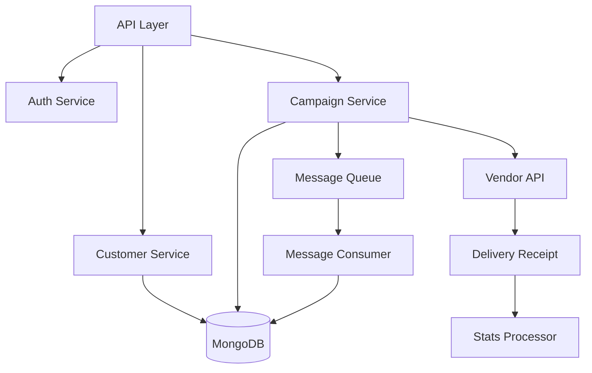

# Mini CRM Backend 🔧

Node.js backend for the Mini CRM platform with campaign management and customer data processing.

## ✨ Implemented Features

### Data Management
- Customer data ingestion API
- Order data processing
- Asynchronous data persistence
- Message queue integration

### Campaign Processing
- Campaign creation and management
- Audience segmentation processing
- Message delivery system
- Delivery receipt handling
- Campaign statistics tracking

### Authentication
- Google OAuth 2.0 implementation
- JWT token management
- Protected routes middleware

## 🏗️ Architecture



## 🛠️ Tech Stack

- Node.js runtime
- Express.js framework
- MongoDB with Mongoose
- Redis/RabbitMQ for queues
- Passport.js for auth

## 🚀 Getting Started

### Prerequisites
- Node.js 18+
- MongoDB
- Redis/RabbitMQ
- Google OAuth credentials

### Installation

1. Install dependencies:
```bash
npm install
```

2. Create `.env` file:
```env
PORT=3000
MONGODB_URI=mongodb://localhost:27017/crm
GOOGLE_CLIENT_ID=your_google_client_id
GOOGLE_CLIENT_SECRET=your_google_client_secret
FRONTEND_URL=http://localhost:5173
```

3. Start development server:
```bash
npm run dev
```

## 📊 API Documentation

### Customer Endpoints

#### POST /api/customers
Create a new customer
```javascript
{
  "name": "string",
  "email": "string",
  "totalSpent": "number",
  "visits": "number",
  "lastVisit": "date"
}
```

#### GET /api/customers
List all customers with optional filters

### Campaign Endpoints

#### POST /api/campaigns
Create a new campaign
```javascript
{
  "name": "string",
  "message": "string",
  "rules": [
    {
      "condition": "string",
      "operator": "string",
      "value": "number",
      "conjunction": "string"
    }
  ]
}
```

#### GET /api/campaigns
List all campaigns

#### POST /api/campaigns/:id/start
Start a campaign delivery

#### GET /api/campaigns/:id/stats
Get campaign delivery statistics

### Authentication Endpoints

#### GET /auth/google
Initialize Google OAuth flow

#### GET /auth/google/callback
OAuth callback handler

#### POST /auth/logout
Logout user

## 🔒 Security Features

- JWT authentication
- Request validation
- Rate limiting
- CORS configuration
- Input sanitization

